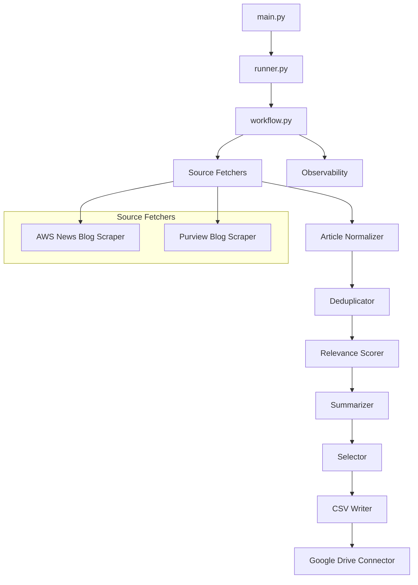

# Design Document: Content Agent

## Overview

The Content Agent is a Python-based curation pipeline that fetches articles from cloud security blogs, normalizes and scores them, and outputs a CSV for LinkedIn content drafting. The system follows a linear pipeline architecture with independent, testable components.

## Architecture



The pipeline executes sequentially:
1. Load configuration and initialize run context
2. Fetch articles from each source (failures isolated per source)
3. Normalize all articles to common schema
4. Deduplicate by URL then title
5. Score for recency and relevance
6. Generate summaries and LinkedIn metadata
7. Select top N articles
8. Write CSV output
9. Upload to Google Drive
10. Emit observability logs

## Components and Interfaces

### Entry Point (src/main.py)

```python
def main(mock: bool = False, verbose: bool = False) -> int:
    """
    Entry point for the content agent.
    
    Args:
        mock: If True, use mock data instead of live fetching
        verbose: If True, enable verbose logging
    
    Returns:
        Exit code (0 for success, non-zero for failure)
    """
```

### Configuration (src/config/settings.py)

```python
@dataclass
class Settings:
    google_drive_folder_id: str
    max_articles_per_source: int = 50
    recency_window_days: int = 30
    target_selected: int = 10
    min_score_threshold: float = 0.0
    recency_weight: float = 0.4
    relevance_weight: float = 0.6
    request_delay_seconds: float = 1.0
    max_retries: int = 3
    keywords: dict[str, list[str]]  # theme -> keywords

def load_settings() -> Settings:
    """Load settings from environment and defaults."""
```

### Article Data Model (src/engines/article_normalizer.py)

```python
@dataclass
class RawArticle:
    source: str
    title: str
    url: str
    published_date: str | None
    author: str | None
    teaser: str | None

@dataclass
class NormalizedArticle:
    source: str
    title: str
    canonical_url: str
    published_date: datetime | None
    author: str | None
    summary_text: str | None

@dataclass
class ScoredArticle:
    source: str
    title: str
    url: str
    published_date: datetime | None
    author: str | None
    summary: str
    key_topics: list[str]
    why_it_matters: str
    suggested_linkedin_angle: str
    suggested_hashtags: list[str]
    score_overall: float
    score_recency: float
    score_relevance: float
    collected_at: datetime
```

### Source Fetcher Interface (src/engines/source_fetcher.py)

```python
class SourceFetcher(Protocol):
    def fetch(self, limit: int) -> list[RawArticle]:
        """Fetch articles from the source up to limit."""
    
    @property
    def source_name(self) -> str:
        """Return the source identifier."""
```

### AWS News Blog Scraper (src/engines/aws_news_blog_scraper.py)

```python
class AWSNewsBlogScraper:
    def __init__(self, settings: Settings):
        self.settings = settings
        self.source_name = "AWS News Blog"
    
    def fetch(self, limit: int) -> list[RawArticle]:
        """
        Fetch articles from AWS News Blog.
        Prefers RSS feed, falls back to HTML scraping.
        Implements retry with exponential backoff.
        """
```

### Purview Blog Scraper (src/engines/purview_blog_scraper.py)

```python
class PurviewBlogScraper:
    def __init__(self, settings: Settings):
        self.settings = settings
        self.source_name = "Microsoft Purview Blog"
    
    def fetch(self, limit: int) -> list[RawArticle]:
        """
        Fetch articles from Microsoft Purview blog.
        Prefers RSS feed, falls back to HTML scraping.
        Implements retry with exponential backoff.
        """
```

### Article Normalizer (src/engines/article_normalizer.py)

```python
def normalize_url(url: str) -> str:
    """Strip tracking parameters and normalize URL."""

def parse_date(date_str: str | None) -> datetime | None:
    """Parse date string to datetime, return None on failure."""

def normalize_article(raw: RawArticle) -> NormalizedArticle:
    """Convert raw article to normalized format."""

def normalize_articles(articles: list[RawArticle]) -> list[NormalizedArticle]:
    """Normalize a batch of articles."""
```

### Deduplicator (src/engines/deduplication.py)

```python
@dataclass
class DeduplicationResult:
    articles: list[NormalizedArticle]
    removed_count: int
    removed_by_url: int
    removed_by_title: int

def normalize_title(title: str) -> str:
    """Normalize title for comparison (lowercase, collapse whitespace)."""

def deduplicate(articles: list[NormalizedArticle]) -> DeduplicationResult:
    """
    Remove duplicates by canonical URL, then by normalized title.
    Keep article with earliest published date when duplicates found.
    """
```

### Relevance Scorer (src/engines/relevance_scorer.py)

```python
def calculate_recency_score(
    published_date: datetime | None,
    window_days: int,
    reference_date: datetime | None = None
) -> float:
    """
    Calculate recency score (0-100).
    100 for today, approaches 0 at window edge.
    Returns 0 if published_date is None or outside window.
    """

def calculate_relevance_score(
    title: str,
    summary: str | None,
    keywords: dict[str, list[str]]
) -> float:
    """
    Calculate relevance score (0-100) based on keyword matches.
    Searches title and summary for theme keywords.
    """

def calculate_overall_score(
    recency_score: float,
    relevance_score: float,
    recency_weight: float = 0.4,
    relevance_weight: float = 0.6
) -> float:
    """Calculate weighted overall score."""

def score_articles(
    articles: list[NormalizedArticle],
    settings: Settings
) -> list[tuple[NormalizedArticle, float, float, float]]:
    """Score all articles, return with (article, overall, recency, relevance)."""
```

### Summarizer (src/engines/summarizer.py)

```python
def generate_summary(article: NormalizedArticle) -> str:
    """Generate 1-3 sentence summary from article content."""

def generate_why_it_matters(article: NormalizedArticle, topics: list[str]) -> str:
    """Generate security-first 'why it matters' statement."""

def generate_linkedin_angle(article: NormalizedArticle) -> str:
    """Generate suggested LinkedIn angle (1 sentence)."""

def generate_hashtags(topics: list[str]) -> list[str]:
    """Generate relevant hashtags from topics."""

def extract_key_topics(article: NormalizedArticle, keywords: dict[str, list[str]]) -> list[str]:
    """Extract key topics that match configured themes."""
```

### Selector (src/engines/selector.py)

```python
def select_top_articles(
    scored_articles: list[tuple[NormalizedArticle, float, float, float]],
    target_count: int,
    min_threshold: float = 0.0
) -> list[tuple[NormalizedArticle, float, float, float]]:
    """
    Select top N articles by overall score.
    Excludes articles below min_threshold.
    Returns all if fewer than target available.
    """
```

### CSV Writer (src/engines/csv_writer.py)

```python
def format_scored_article_for_csv(article: ScoredArticle) -> dict[str, str]:
    """Format article fields for CSV output."""

def write_csv(
    articles: list[ScoredArticle],
    output_dir: str = "src/output"
) -> str:
    """
    Write articles to CSV file.
    Returns the filepath of the written file.
    Filename format: content_candidates_YYYYMMDD_HHMMSS.csv
    """
```

### Google Drive Connector (src/connectors/google_drive.py)

```python
@dataclass
class UploadResult:
    success: bool
    file_id: str | None
    folder_id: str | None
    error: str | None

def upload_file(
    filepath: str,
    folder_id: str,
    credentials_path: str = "credentials.json"
) -> UploadResult:
    """
    Upload file to Google Drive folder.
    Uses service account authentication.
    """
```

### Observability (src/engines/observability.py)

```python
@dataclass
class RunMetrics:
    fetched_count_by_source: dict[str, int]
    normalized_count: int
    deduped_count: int
    selected_count: int
    top_topics: list[str]
    average_score_overall: float
    upload_status: str
    uploaded_file_id: str | None
    errors: list[str]
    run_timestamp: datetime

def create_run_metrics(...) -> RunMetrics:
    """Create metrics from pipeline results."""

def write_run_log(metrics: RunMetrics, output_dir: str = "src/output") -> str:
    """Write run log JSON file, return filepath."""

def log_stage_counts(stage: str, count: int) -> None:
    """Log count for a pipeline stage."""
```

### Workflow Orchestrator (src/agent/workflow.py)

```python
@dataclass
class WorkflowResult:
    success: bool
    csv_path: str | None
    upload_result: UploadResult | None
    metrics: RunMetrics

def run_pipeline(settings: Settings) -> WorkflowResult:
    """
    Execute the full curation pipeline.
    Handles errors gracefully, continues on partial failures.
    """
```

## Data Models

### RawArticle
Represents an article as fetched from a source before normalization.

| Field | Type | Description |
|-------|------|-------------|
| source | str | Source identifier (e.g., "AWS News Blog") |
| title | str | Article title as scraped |
| url | str | Article URL as scraped (may contain tracking params) |
| published_date | str \| None | Date string in source format |
| author | str \| None | Author name if available |
| teaser | str \| None | Teaser or first paragraph |

### NormalizedArticle
Represents an article after normalization with standardized fields.

| Field | Type | Description |
|-------|------|-------------|
| source | str | Source identifier |
| title | str | Cleaned title |
| canonical_url | str | URL with tracking params removed |
| published_date | datetime \| None | Parsed datetime |
| author | str \| None | Author name |
| summary_text | str \| None | Teaser/summary text |

### ScoredArticle
Represents a fully processed article ready for CSV output.

| Field | Type | Description |
|-------|------|-------------|
| source | str | Source identifier |
| title | str | Article title |
| url | str | Canonical URL |
| published_date | datetime \| None | Publication date |
| author | str \| None | Author name |
| summary | str | Generated 1-3 sentence summary |
| key_topics | list[str] | Extracted topic keywords |
| why_it_matters | str | Security-first framing statement |
| suggested_linkedin_angle | str | LinkedIn post angle |
| suggested_hashtags | list[str] | Relevant hashtags |
| score_overall | float | Weighted overall score (0-100) |
| score_recency | float | Recency score (0-100) |
| score_relevance | float | Relevance score (0-100) |
| collected_at | datetime | Timestamp of collection |


## Correctness Properties

*A property is a characteristic or behavior that should hold true across all valid executions of a system—essentially, a formal statement about what the system should do. Properties serve as the bridge between human-readable specifications and machine-verifiable correctness guarantees.*

### Property 1: Source Fetch Limit

*For any* source fetcher and any configured limit N, the number of articles returned SHALL be at most N.

**Validates: Requirements 1.8**

### Property 2: Source Fetch Isolation

*For any* set of configured sources where one or more sources fail, the Content_Agent SHALL still return articles from the sources that succeeded.

**Validates: Requirements 1.1, 1.2**

### Property 3: Normalization Structure Preservation

*For any* valid RawArticle, normalizing it SHALL produce a NormalizedArticle with all required fields (source, title, canonical_url, published_date, author, summary_text) present.

**Validates: Requirements 2.1**

### Property 4: URL Canonicalization

*For any* URL containing tracking parameters (utm_source, utm_medium, utm_campaign, fbclid, etc.), the canonical URL SHALL not contain those parameters.

**Validates: Requirements 2.2**

### Property 5: Date Parsing Round-Trip

*For any* datetime value, formatting it to a standard string and parsing it back SHALL produce an equivalent datetime.

**Validates: Requirements 2.3**

### Property 6: Text Normalization

*For any* string with leading or trailing whitespace, normalizing it SHALL produce a string without leading or trailing whitespace.

**Validates: Requirements 2.5**

### Property 7: Deduplication URL Uniqueness

*For any* list of articles, after deduplication, all canonical URLs in the result SHALL be unique.

**Validates: Requirements 3.1**

### Property 8: Deduplication Title Uniqueness

*For any* list of articles after URL deduplication, after title deduplication, all normalized titles in the result SHALL be unique.

**Validates: Requirements 3.2**

### Property 9: Deduplication Keeps Earliest

*For any* set of duplicate articles (by URL or title), the article kept after deduplication SHALL have the earliest (minimum) published_date among the duplicates.

**Validates: Requirements 3.3**

### Property 10: Deduplication Count Invariant

*For any* deduplication operation, the removed_count SHALL equal the input count minus the output count.

**Validates: Requirements 3.4**

### Property 11: Score Bounds

*For any* article and scoring configuration, recency_score, relevance_score, and overall_score SHALL all be in the range [0, 100].

**Validates: Requirements 4.1, 4.4**

### Property 12: Keyword Matching Contribution

*For any* article containing a configured keyword in its title or summary, the relevance_score SHALL be greater than 0.

**Validates: Requirements 4.5**

### Property 13: Overall Score Calculation

*For any* recency_score R, relevance_score V, and weights (w1, w2) where w1 + w2 = 1, the overall_score SHALL equal w1 * R + w2 * V.

**Validates: Requirements 4.6**

### Property 14: Summary Sentence Count

*For any* generated summary, it SHALL contain between 1 and 3 sentences (inclusive).

**Validates: Requirements 5.1**

### Property 15: LinkedIn Angle Sentence Count

*For any* generated LinkedIn angle, it SHALL contain exactly 1 sentence.

**Validates: Requirements 5.3**

### Property 16: Hashtag Generation

*For any* article with at least one matching topic, the generated hashtags list SHALL be non-empty.

**Validates: Requirements 5.4**

### Property 17: Topic Extraction

*For any* article containing configured keywords, the extracted key_topics SHALL include at least one matching theme.

**Validates: Requirements 5.5**

### Property 18: Selection Sorting

*For any* list of selected articles, the articles SHALL be sorted by overall_score in descending order.

**Validates: Requirements 6.1**

### Property 19: Selection Count

*For any* target count N and list of M articles (after threshold filtering), the selected count SHALL be min(N, M).

**Validates: Requirements 6.2**

### Property 20: Selection Threshold

*For any* minimum threshold T, all selected articles SHALL have overall_score >= T.

**Validates: Requirements 6.4**

### Property 21: CSV Output Validation

*For any* list of ScoredArticles written to CSV:
- The filename SHALL match pattern `content_candidates_YYYYMMDD_HHMMSS.csv`
- The CSV SHALL contain all required columns
- Multi-value fields (key_topics, suggested_hashtags) SHALL use semicolon delimiters
- The file SHALL be valid UTF-8

**Validates: Requirements 7.1, 7.2, 7.3, 7.4**

### Property 22: Metrics Completeness

*For any* pipeline run, the RunMetrics SHALL contain:
- fetched_count_by_source (dict with counts per source)
- normalized_count, deduped_count, selected_count (integers)
- top_topics (list)
- upload_status (string)
- errors (list)

**Validates: Requirements 9.1, 9.2, 9.3, 9.4, 9.5**

### Property 23: Configuration Defaults

*For any* missing configuration value, the Settings SHALL use the documented default value.

**Validates: Requirements 10.3**

### Property 24: Configuration Validation

*For any* invalid configuration value (e.g., negative limits, weights not summing to 1), loading settings SHALL raise a validation error.

**Validates: Requirements 10.4**

## Error Handling

### Source Fetching Errors
- Network failures: Retry with exponential backoff (max 3 retries)
- Parse errors: Log warning, skip malformed articles
- Source unavailable: Log error, continue with other sources
- Rate limiting: Respect delays, back off if 429 received

### Normalization Errors
- Invalid date format: Set published_date to None, log warning
- Missing required fields: Skip article, log warning
- Encoding errors: Attempt UTF-8 decode with error replacement

### Scoring Errors
- Missing published_date: Assign recency_score of 0
- Empty content: Assign relevance_score of 0

### Output Errors
- File write failure: Raise exception (critical failure)
- Google Drive upload failure: Log error, continue (non-critical)

### Configuration Errors
- Missing required config: Raise exception at startup
- Invalid values: Raise validation error at startup
- Missing .env file: Use defaults where possible, warn for missing secrets

## Testing Strategy

### Property-Based Testing

The project will use **Hypothesis** for property-based testing in Python. Each correctness property will be implemented as a property-based test with minimum 100 iterations.

Test file organization:
```
tests/
├── test_normalizer_properties.py
├── test_deduplication_properties.py
├── test_scorer_properties.py
├── test_summarizer_properties.py
├── test_selector_properties.py
├── test_csv_writer_properties.py
├── test_config_properties.py
└── test_integration.py
```

Each property test must be annotated with:
```python
# Feature: content-agent, Property N: [Property Title]
# Validates: Requirements X.Y
```

### Unit Testing

Unit tests complement property tests for:
- Specific example inputs and expected outputs
- Edge cases (empty lists, None values, boundary conditions)
- Error conditions and exception handling
- Integration points between components

Unit test examples:
- AWS scraper parses sample RSS feed correctly
- Purview scraper parses sample HTML correctly
- URL canonicalization removes specific tracking params
- Date parser handles various date formats
- CSV writer produces valid CSV structure

### Test Configuration

```python
# conftest.py
from hypothesis import settings

settings.register_profile("ci", max_examples=100)
settings.register_profile("dev", max_examples=20)
settings.load_profile("ci")
```

### Test Coverage Goals

- Property tests: All 24 correctness properties
- Unit tests: Critical paths and edge cases
- Integration tests: End-to-end pipeline with mock data
- Target: 80%+ code coverage
