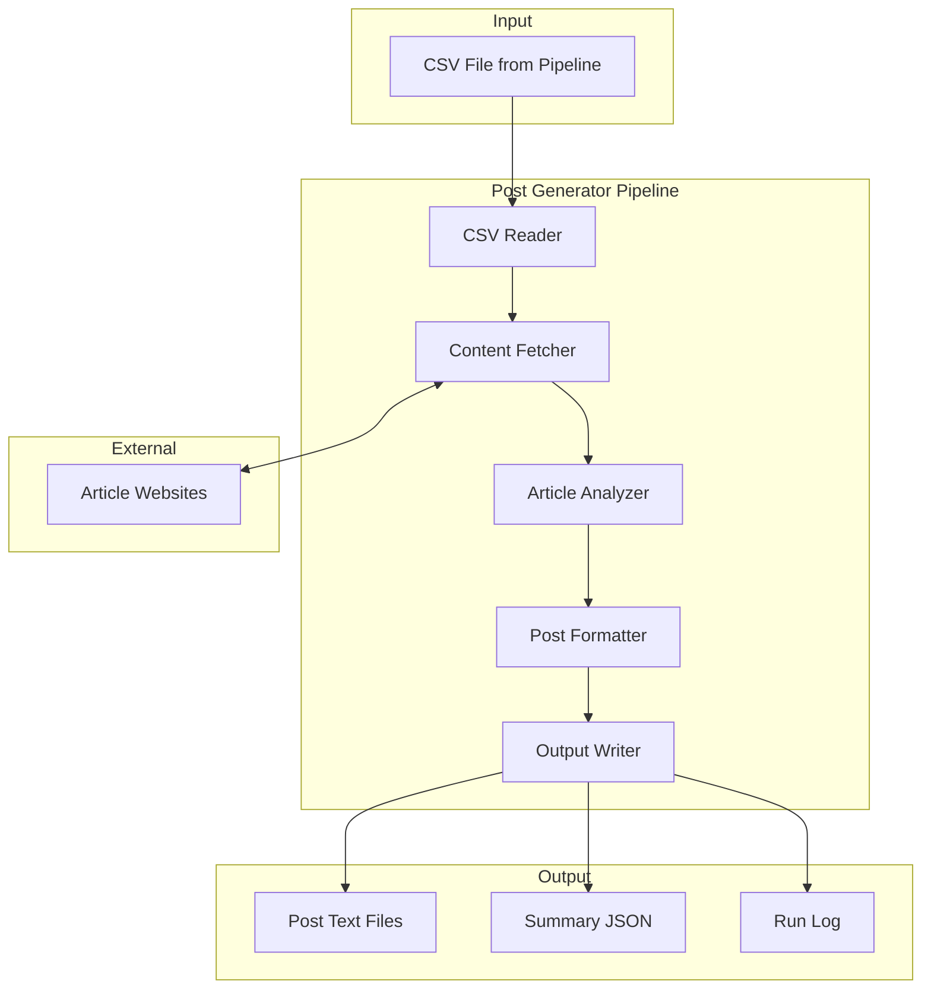

# Design Document: LinkedIn Post Generator

## Overview

The LinkedIn Post Generator extends the Content Agent pipeline to transform curated article metadata into professionally formatted LinkedIn posts. The system reads article URLs from the existing CSV output, fetches full article content, analyzes it for key facts and statistics, and generates posts following a specific engagement-optimized format targeting security and IT leadership audiences.

The design follows the existing project patterns with separate engine components for each responsibility, dataclasses for data models, and integration with the existing workflow infrastructure.

## Architecture



### Component Flow

1. **CSV Reader** parses the pipeline output CSV and extracts article metadata
2. **Content Fetcher** retrieves full HTML content from article URLs with retry logic
3. **Article Analyzer** extracts facts, statistics, threats, and recommendations from content
4. **Post Formatter** structures extracted data into the target LinkedIn post format
5. **Output Writer** saves generated posts to files and writes run metadata

## Components and Interfaces

### CSV Reader (`src/engines/post_csv_reader.py`)

Reads article metadata from the existing pipeline CSV output.

```python
from dataclasses import dataclass

@dataclass
class ArticleInput:
    """Article metadata from CSV for post generation."""
    url: str
    title: str
    source: str
    key_topics: list[str]
    summary: str
    published_date: str | None = None
    author: str | None = None

def read_articles_from_csv(csv_path: str) -> tuple[list[ArticleInput], list[str]]:
    """Read article metadata from CSV file.
    
    Args:
        csv_path: Path to the CSV file
        
    Returns:
        Tuple of (articles, errors) where errors contains any parsing issues
    """
    ...
```

### Content Fetcher (`src/engines/post_content_fetcher.py`)

Fetches and extracts article body content from URLs.

```python
from dataclasses import dataclass

@dataclass
class FetchResult:
    """Result of fetching article content."""
    success: bool
    url: str
    content: str | None = None
    error: str | None = None
    status_code: int | None = None

def fetch_article_content(
    url: str,
    timeout: float = 30.0,
    max_retries: int = 3,
    retry_delay: float = 1.0
) -> FetchResult:
    """Fetch and extract article body content from URL.
    
    Args:
        url: Article URL to fetch
        timeout: Request timeout in seconds
        max_retries: Maximum retry attempts
        retry_delay: Delay between retries in seconds
        
    Returns:
        FetchResult with extracted content or error details
    """
    ...

def extract_article_body(html: str) -> str:
    """Extract main article body text from HTML.
    
    Removes navigation, ads, sidebars, and other non-article elements.
    
    Args:
        html: Raw HTML content
        
    Returns:
        Cleaned article body text
    """
    ...
```

### Article Analyzer (`src/engines/post_article_analyzer.py`)

Analyzes article content to extract structured information for post generation.

```python
from dataclasses import dataclass

@dataclass
class AnalyzedContent:
    """Structured content extracted from article analysis."""
    main_topic: str
    opening_fact: str
    statistics: list[str]
    key_points: list[str]
    real_impact: str | None
    defense_strategies: list[str]
    hook_question: str

def analyze_article(content: str, title: str) -> AnalyzedContent:
    """Analyze article content and extract structured information.
    
    Args:
        content: Full article body text
        title: Article title for context
        
    Returns:
        AnalyzedContent with extracted facts, statistics, and insights
    """
    ...

def extract_statistics(content: str) -> list[str]:
    """Extract numerical statistics and specific facts from content.
    
    Args:
        content: Article body text
        
    Returns:
        List of extracted statistics (e.g., "338 phishing domains", "5,000+ credentials")
    """
    ...

def extract_key_points(content: str) -> list[str]:
    """Extract key points suitable for bullet list.
    
    Args:
        content: Article body text
        
    Returns:
        List of 3-7 key points from the article
    """
    ...

def extract_defense_strategies(content: str) -> list[str]:
    """Extract actionable defense strategies or recommendations.
    
    Args:
        content: Article body text
        
    Returns:
        List of defense strategies mentioned in the article
    """
    ...
```

### Post Formatter (`src/engines/post_formatter.py`)

Formats analyzed content into the target LinkedIn post structure.

```python
from dataclasses import dataclass

@dataclass
class GeneratedPost:
    """A fully formatted LinkedIn post."""
    url: str
    title: str
    content: str
    hashtags: list[str]
    character_count: int

def format_linkedin_post(
    analyzed: AnalyzedContent,
    url: str,
    title: str,
    topics: list[str]
) -> GeneratedPost:
    """Format analyzed content into a LinkedIn post.
    
    Args:
        analyzed: Structured content from article analysis
        url: Original article URL
        title: Article title
        topics: Key topics for hashtag generation
        
    Returns:
        GeneratedPost with fully formatted content
    """
    ...

def generate_opening_line(fact: str, topic: str) -> str:
    """Generate attention-grabbing opening line with specific facts.
    
    Args:
        fact: Key statistic or fact from article
        topic: Main topic of the article
        
    Returns:
        Opening line string
    """
    ...

def format_bullet_list(points: list[str]) -> str:
    """Format key points as bullet list with checkmark emojis.
    
    Args:
        points: List of key points
        
    Returns:
        Formatted bullet list string with ✅ emojis
    """
    ...

def generate_hashtags(topics: list[str]) -> list[str]:
    """Generate relevant hashtags from article topics.
    
    Args:
        topics: Key topics from article
        
    Returns:
        List of 3-5 hashtags
    """
    ...
```

### Output Writer (`src/engines/post_output_writer.py`)

Writes generated posts to files and creates run metadata.

```python
from dataclasses import dataclass
from datetime import datetime

@dataclass
class PostOutputResult:
    """Result of writing post outputs."""
    output_dir: str
    post_files: list[str]
    summary_file: str
    post_count: int

def write_posts(
    posts: list[GeneratedPost],
    output_dir: str = "src/output/posts"
) -> PostOutputResult:
    """Write generated posts to individual text files.
    
    Args:
        posts: List of generated posts
        output_dir: Base output directory
        
    Returns:
        PostOutputResult with file paths and counts
    """
    ...

def write_summary_json(
    posts: list[GeneratedPost],
    output_dir: str,
    run_timestamp: datetime
) -> str:
    """Write summary JSON with metadata for all posts.
    
    Args:
        posts: List of generated posts
        output_dir: Output directory path
        run_timestamp: Timestamp of the generation run
        
    Returns:
        Path to the summary JSON file
    """
    ...
```

### Post Generator Orchestrator (`src/engines/post_generator.py`)

Main orchestrator that coordinates the post generation pipeline.

```python
from dataclasses import dataclass

@dataclass
class PostGeneratorResult:
    """Result of post generation run."""
    success: bool
    posts: list[GeneratedPost]
    failures: list[tuple[str, str]]  # (url, error)
    output_result: PostOutputResult | None
    metrics: PostGeneratorMetrics

@dataclass
class PostGeneratorMetrics:
    """Metrics from post generation run."""
    articles_processed: int
    posts_generated: int
    failures_count: int
    processing_time_seconds: float

def generate_posts_from_csv(
    csv_path: str,
    settings: PostGeneratorSettings
) -> PostGeneratorResult:
    """Generate LinkedIn posts from articles in CSV file.
    
    Args:
        csv_path: Path to the pipeline output CSV
        settings: Configuration settings
        
    Returns:
        PostGeneratorResult with generated posts and metrics
    """
    ...
```

### Configuration (`src/config/post_settings.py`)

Configuration dataclass for post generator settings.

```python
from dataclasses import dataclass

@dataclass
class PostGeneratorSettings:
    """Configuration settings for post generation."""
    max_posts: int = 10
    request_timeout: float = 30.0
    max_retries: int = 3
    retry_delay: float = 1.0
    min_content_length: int = 500
    additional_hashtags: list[str] | None = None
    
    @classmethod
    def from_env(cls) -> "PostGeneratorSettings":
        """Load settings from environment variables."""
        ...
```

## Data Models

### ArticleInput

Represents article metadata read from the CSV input.

| Field | Type | Description |
|-------|------|-------------|
| url | str | Article URL |
| title | str | Article title |
| source | str | Source name (AWS News Blog, Microsoft Purview Blog) |
| key_topics | list[str] | Matched topic themes |
| summary | str | Article summary from pipeline |
| published_date | str \| None | Publication date |
| author | str \| None | Author name |

### AnalyzedContent

Structured content extracted from article analysis.

| Field | Type | Description |
|-------|------|-------------|
| main_topic | str | Primary topic/threat/announcement |
| opening_fact | str | Key statistic for opening line |
| statistics | list[str] | Extracted numerical facts |
| key_points | list[str] | 3-7 key points for bullet list |
| real_impact | str \| None | Real-world impact example |
| defense_strategies | list[str] | Actionable recommendations |
| hook_question | str | Hook question for post |

### GeneratedPost

A fully formatted LinkedIn post ready for output.

| Field | Type | Description |
|-------|------|-------------|
| url | str | Original article URL |
| title | str | Article title |
| content | str | Full formatted post content |
| hashtags | list[str] | Generated hashtags |
| character_count | int | Total character count |

### FetchResult

Result of fetching article content from URL.

| Field | Type | Description |
|-------|------|-------------|
| success | bool | Whether fetch succeeded |
| url | str | Fetched URL |
| content | str \| None | Extracted article content |
| error | str \| None | Error message if failed |
| status_code | int \| None | HTTP status code |

### PostGeneratorResult

Result of a complete post generation run.

| Field | Type | Description |
|-------|------|-------------|
| success | bool | Overall success status |
| posts | list[GeneratedPost] | Successfully generated posts |
| failures | list[tuple[str, str]] | Failed articles (url, error) |
| output_result | PostOutputResult \| None | Output file information |
| metrics | PostGeneratorMetrics | Run metrics |

## Correctness Properties

*A property is a characteristic or behavior that should hold true across all valid executions of a system—essentially, a formal statement about what the system should do. Properties serve as the bridge between human-readable specifications and machine-verifiable correctness guarantees.*

### Property 1: CSV Parsing Round-Trip

*For any* valid CSV content containing article rows with url, title, source, key_topics, and summary fields, parsing the CSV SHALL produce ArticleInput objects where each field matches the original CSV values.

**Validates: Requirements 1.1, 1.4**

### Property 2: CSV Graceful Degradation

*For any* CSV file containing a mix of valid and malformed rows, the CSV_Reader SHALL return all valid rows as ArticleInput objects while the malformed rows are excluded from the result.

**Validates: Requirements 1.3**

### Property 3: HTML Content Extraction

*For any* HTML document containing article body content mixed with navigation, ads, and sidebar elements, the extract_article_body function SHALL return text that contains the article content and excludes the non-article elements.

**Validates: Requirements 2.1, 2.4**

### Property 4: Statistics Extraction

*For any* article content containing numerical statistics (e.g., "338 domains", "5,000+ credentials", "$355/month"), the extract_statistics function SHALL return a list containing those statistics.

**Validates: Requirements 3.1**

### Property 5: Content Analysis Structure

*For any* non-empty article content and title, the analyze_article function SHALL return an AnalyzedContent object with non-empty main_topic, opening_fact, and key_points fields.

**Validates: Requirements 3.2, 3.3, 3.4, 3.5**

### Property 6: Post Contains Required Sections

*For any* valid AnalyzedContent with non-empty fields, the formatted LinkedIn post SHALL contain: an opening line, a hook question (containing "?"), a detailed explanation, a "Real impact:" section (when real_impact is provided), a "Defense strategy:" section (when defense_strategies is provided), a closing statement, and an engagement question.

**Validates: Requirements 4.1, 4.2, 4.3, 4.5, 4.6, 4.7, 4.8**

### Property 7: Bullet List Format

*For any* AnalyzedContent with 3-7 key_points, the formatted post SHALL contain exactly that many lines with ✅ emoji prefixes.

**Validates: Requirements 4.4**

### Property 8: Post Contains URL and Hashtags

*For any* generated post, the content SHALL contain the original article URL and between 3-5 hashtags (strings starting with #).

**Validates: Requirements 4.9, 4.10**

### Property 9: Generator Processes All Articles

*For any* list of N article inputs, the Post_Generator SHALL return a result where the sum of successful posts and failures equals N.

**Validates: Requirements 5.1, 5.2**

### Property 10: Generator Result Consistency

*For any* post generation run, the metrics.posts_generated SHALL equal len(posts) and metrics.failures_count SHALL equal len(failures).

**Validates: Requirements 5.3, 5.4**

### Property 11: Output File Structure

*For any* list of N generated posts, the write_posts function SHALL create N individual text files and one summary JSON file in a timestamped directory matching the pattern `src/output/posts/YYYYMMDD_HHMMSS/`.

**Validates: Requirements 6.1, 6.2, 6.3**

### Property 12: Output Encoding Round-Trip

*For any* generated post containing emojis (✅) and special characters, writing to file and reading back SHALL preserve all characters exactly.

**Validates: Requirements 6.4**

### Property 13: Configuration Limits Posts

*For any* configuration with max_posts=M and a CSV with N articles where N > M, the generator SHALL produce at most M posts.

**Validates: Requirements 7.2**

### Property 14: Minimum Content Length Filter

*For any* configuration with min_content_length=L, articles with content shorter than L characters SHALL be skipped and appear in the failures list.

**Validates: Requirements 7.4**

### Property 15: Additional Hashtags

*For any* configuration with additional_hashtags specified, all generated posts SHALL include those hashtags in addition to the topic-derived hashtags.

**Validates: Requirements 7.5**

### Property 16: Run Log Creation

*For any* completed post generation run, a run log JSON file SHALL be created containing articles_processed, posts_generated, failures_count, and processing_time_seconds fields.

**Validates: Requirements 8.2**

## Error Handling

### CSV Reader Errors

| Error Condition | Handling |
|-----------------|----------|
| File not found | Return empty list with error message |
| Permission denied | Return empty list with error message |
| Malformed row | Skip row, log warning, continue processing |
| Missing required field | Skip row, log warning, continue processing |

### Content Fetcher Errors

| Error Condition | Handling |
|-----------------|----------|
| HTTP 4xx/5xx | Return FetchResult with success=False and status_code |
| Connection timeout | Retry up to max_retries, then return timeout error |
| SSL/TLS error | Return FetchResult with error description |
| Invalid URL | Return FetchResult with error description |

### Article Analyzer Errors

| Error Condition | Handling |
|-----------------|----------|
| Empty content | Return AnalyzedContent with fallback values from title |
| Content too short | Skip article, add to failures list |
| Parsing error | Log error, return partial AnalyzedContent |

### Post Generator Errors

| Error Condition | Handling |
|-----------------|----------|
| All articles fail | Return result with empty posts, all in failures |
| Output directory creation fails | Log error, return result without output_result |
| File write fails | Log error, continue with remaining posts |

## Testing Strategy

### Property-Based Testing

Use Hypothesis library for property-based tests with minimum 100 iterations per property.

**Test File Structure:**
```
tests/
├── test_post_csv_reader_properties.py    # Properties 1-2
├── test_post_content_fetcher_properties.py # Properties 3-4
├── test_post_analyzer_properties.py      # Property 5
├── test_post_formatter_properties.py     # Properties 6-8
├── test_post_generator_properties.py     # Properties 9-10, 13-14
├── test_post_output_properties.py        # Properties 11-12
├── test_post_config_properties.py        # Property 15
└── test_post_observability_properties.py # Property 16
```

**Generators Required:**
- `article_input_strategy`: Generate valid ArticleInput objects
- `csv_content_strategy`: Generate valid CSV content with article rows
- `html_content_strategy`: Generate HTML with article body and noise elements
- `analyzed_content_strategy`: Generate valid AnalyzedContent objects
- `statistics_text_strategy`: Generate text containing numerical statistics

### Unit Tests

Unit tests complement property tests for specific examples and edge cases:

- CSV parsing with real pipeline output format
- HTML extraction for AWS News Blog and Purview Blog page structures
- Post formatting with example article content
- Error handling for network failures (mocked)
- Configuration loading from environment variables

### Integration Tests

- End-to-end test with sample CSV input
- Output file verification
- Run log structure validation

