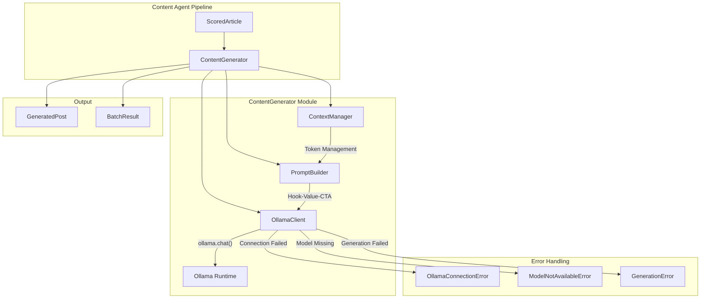
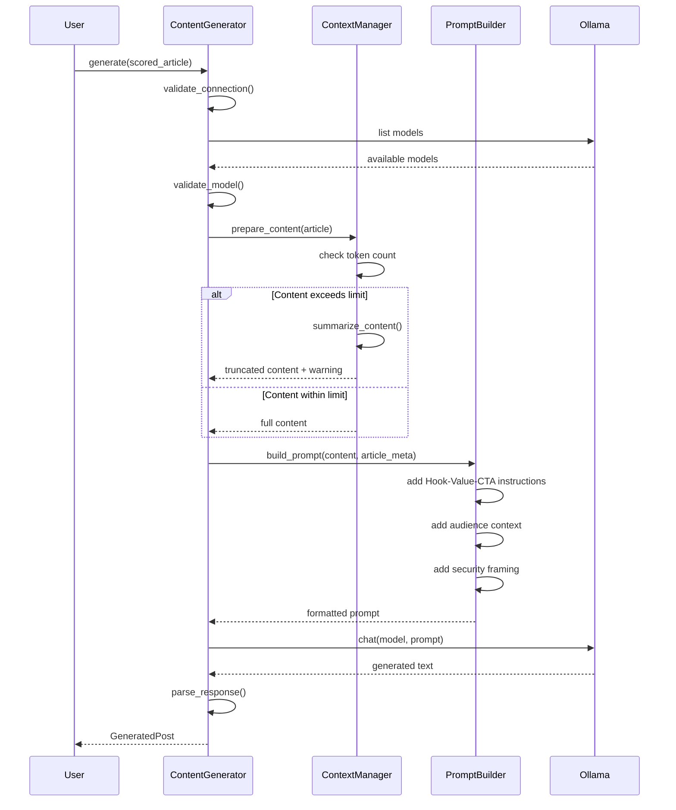

# Design Document: Ollama Content Generator

## Overview

The Ollama Content Generator is a new engine module that integrates with the local Ollama LLM runtime to transform scraped article content into high-engagement LinkedIn posts. It follows the Hook-Value-CTA framework to structure posts for maximum engagement and supports multiple models for different use cases.

The module is designed as a class-based component (`ContentGenerator`) that:
1. Connects to a local Ollama instance
2. Validates model availability
3. Constructs optimized prompts from article data
4. Generates structured LinkedIn posts
5. Handles errors gracefully with clear messaging

This design prioritizes:
- **Modularity**: Clean separation from existing pipeline, usable standalone or integrated
- **Resilience**: Graceful handling of Ollama connection issues and model unavailability
- **Quality**: Well-crafted prompts that consistently produce engaging posts
- **Efficiency**: Support for batch processing with progress tracking

## Architecture



### Component Interaction Flow



## Components and Interfaces

### 1. ContentGenerator Class

The main interface for generating LinkedIn posts from articles.

```python
from dataclasses import dataclass
from datetime import datetime
from typing import Optional

@dataclass
class GeneratedPost:
    """Output structure for a generated LinkedIn post."""
    full_text: str
    hook: str
    value: str
    cta: str
    hashtags: list[str]
    model_used: str
    generated_at: datetime
    source_url: str
    character_count: int

@dataclass
class BatchResult:
    """Result of batch post generation."""
    successful: list[GeneratedPost]
    failed: list[tuple[str, str]]  # (article_title, error_message)
    total_processed: int
    success_rate: float

class ContentGenerator:
    """Generate LinkedIn posts from articles using Ollama."""
    
    def __init__(
        self,
        model: str = "qwen3-coder:30b",
        timeout: int = 120,
        max_tokens: int = 10000,
        num_ctx: int = 16384,
    ) -> None:
        """Initialize the generator with model configuration.
        
        Args:
            model: Ollama model name to use
            timeout: Request timeout in seconds
            max_tokens: Maximum input tokens before truncation
            num_ctx: Context window size for Ollama (passed to num_ctx parameter)
        """
        ...
    
    def generate(self, article: ScoredArticle) -> GeneratedPost:
        """Generate a LinkedIn post from a single article."""
        ...
    
    def generate_batch(
        self, 
        articles: list[ScoredArticle],
        continue_on_error: bool = True,
    ) -> BatchResult:
        """Generate posts for multiple articles."""
        ...
    
    @classmethod
    def list_available_models(cls) -> list[str]:
        """List all models available in Ollama."""
        ...
    
    def is_model_available(self, model: str) -> bool:
        """Check if a specific model is available."""
        ...
```

### 2. OllamaClient (Internal)

Handles communication with the Ollama runtime.

```python
class OllamaClient:
    """Internal client for Ollama API communication."""
    
    def __init__(self, timeout: int = 120, num_ctx: int = 16384) -> None:
        """Initialize client with timeout and context window configuration.
        
        Args:
            timeout: Request timeout in seconds
            num_ctx: Context window size passed to Ollama's num_ctx parameter
        """
        ...
    
    def check_connection(self) -> bool:
        """Verify Ollama is running and accessible."""
        ...
    
    def list_models(self) -> list[str]:
        """Get list of available models."""
        ...
    
    def chat(
        self, 
        model: str, 
        prompt: str,
        system_prompt: Optional[str] = None,
    ) -> str:
        """Send a chat request and return the response.
        
        The num_ctx parameter is passed to Ollama to set the context window size.
        This allows processing longer articles without truncation.
        
        Example Ollama call:
            ollama.chat(
                model=model,
                messages=[...],
                options={'num_ctx': self.num_ctx}
            )
        """
        ...
```

### 3. PromptBuilder (Internal)

Constructs optimized prompts for LinkedIn post generation.

```python
class PromptBuilder:
    """Build prompts for LinkedIn post generation."""
    
    SYSTEM_PROMPT: str  # Base system instructions
    HOOK_VALUE_CTA_TEMPLATE: str  # Framework template
    
    def build(
        self,
        title: str,
        source: str,
        summary: str,
        key_topics: list[str],
        why_it_matters: str,
        hashtags: list[str],
    ) -> str:
        """Build a complete prompt for post generation."""
        ...
    
    def _add_security_framing(self, topics: list[str]) -> str:
        """Add security-first messaging for relevant topics."""
        ...
    
    def _format_audience_context(self) -> str:
        """Format target audience description."""
        ...
```

### 4. ContextManager (Internal)

Manages content length and token limits.

```python
class ContextManager:
    """Manage content length for model context windows."""
    
    def __init__(self, max_tokens: int = 10000) -> None:
        """Initialize with token limit."""
        ...
    
    def estimate_tokens(self, text: str) -> int:
        """Estimate token count for text (approx 4 chars per token)."""
        ...
    
    def prepare_content(
        self, 
        article: ScoredArticle,
    ) -> tuple[str, bool]:
        """
        Prepare article content for prompt.
        
        Returns:
            Tuple of (prepared_content, was_truncated)
        """
        ...
    
    def summarize_for_context(self, text: str, target_tokens: int) -> str:
        """Reduce text to fit within target token count."""
        ...
```

### 5. Custom Exceptions

```python
class OllamaConnectionError(Exception):
    """Raised when unable to connect to Ollama."""
    
    def __init__(self, message: str = "Cannot connect to Ollama"):
        self.message = message
        self.troubleshooting = (
            "Ensure Ollama is running: 'ollama serve'\n"
            "Check if Ollama is accessible at http://localhost:11434"
        )
        super().__init__(f"{message}\n{self.troubleshooting}")

class ModelNotAvailableError(Exception):
    """Raised when requested model is not available in Ollama."""
    
    def __init__(self, model: str):
        self.model = model
        self.message = f"Model '{model}' is not available in Ollama"
        self.troubleshooting = f"Pull the model with: 'ollama pull {model}'"
        super().__init__(f"{self.message}\n{self.troubleshooting}")

class GenerationError(Exception):
    """Raised when post generation fails."""
    
    def __init__(self, article_title: str, cause: str):
        self.article_title = article_title
        self.cause = cause
        super().__init__(f"Failed to generate post for '{article_title}': {cause}")
```

## Data Models

### Input: ScoredArticle (Existing)

The generator accepts `ScoredArticle` objects from the existing pipeline:

```python
@dataclass
class ScoredArticle:
    source: str
    title: str
    url: str
    published_date: datetime | None
    author: str | None
    summary: str
    key_topics: list[str]
    why_it_matters: str
    suggested_linkedin_angle: str
    suggested_hashtags: list[str]
    score_overall: float
    score_recency: float
    score_relevance: float
    collected_at: datetime
```

### Output: GeneratedPost

```python
@dataclass
class GeneratedPost:
    """A generated LinkedIn post with structured sections."""
    
    full_text: str          # Complete post ready to publish
    hook: str               # Attention-grabbing opening
    value: str              # Core insight/takeaway
    cta: str                # Call-to-action
    hashtags: list[str]     # Hashtags included in post
    model_used: str         # Model that generated this post
    generated_at: datetime  # Generation timestamp
    source_url: str         # Original article URL
    character_count: int    # Total character count (max 3000)
```

### Batch Output: BatchResult

```python
@dataclass
class BatchResult:
    """Result of processing multiple articles."""
    
    successful: list[GeneratedPost]           # Successfully generated posts
    failed: list[tuple[str, str]]             # (title, error) for failures
    total_processed: int                       # Total articles attempted
    success_rate: float                        # Percentage successful
```

## Prompt Template Design

### System Prompt

```
You are a LinkedIn content strategist specializing in cloud security and enterprise technology. 
Your audience includes CIOs, CISOs, CTOs, and IT Directors in regulated industries 
(finance, healthcare, government, professional services).

Write in a professional yet engaging tone. Be concise and actionable.
Focus on security-first messaging paired with practical modernization guidance.
```

### Hook-Value-CTA Template

```
Create a LinkedIn post about the following article using the Hook-Value-CTA framework:

ARTICLE INFORMATION:
- Title: {title}
- Source: {source}
- Summary: {summary}
- Key Topics: {key_topics}
- Why It Matters: {why_it_matters}

FRAMEWORK REQUIREMENTS:

1. HOOK (1-2 sentences): Start with ONE of these attention-grabbing techniques:
   - A thought-provoking question
   - A surprising statistic or fact
   - A bold statement or prediction
   - A relatable pain point

2. VALUE (3-5 sentences): Provide the core insight:
   - What's the key announcement or update?
   - What's the practical implication for security teams?
   - What action should leaders consider?

3. CTA (1-2 sentences): End with engagement:
   - Ask a question to spark discussion
   - Invite readers to share their experience
   - Suggest a specific next step

FORMAT REQUIREMENTS:
- Use line breaks between sections for readability
- Keep total length under 2800 characters (leave room for hashtags)
- Include these hashtags at the end: {hashtags}
- Use emojis sparingly (1-2 max) if they add value

OUTPUT FORMAT:
Return ONLY the post text, ready to copy-paste to LinkedIn.
```


## Correctness Properties

*A property is a characteristic or behavior that should hold true across all valid executions of a system—essentially, a formal statement about what the system should do. Properties serve as the bridge between human-readable specifications and machine-verifiable correctness guarantees.*

Based on the prework analysis, the following properties have been consolidated to eliminate redundancy while ensuring comprehensive coverage:

### Property 1: Connection Error Handling

*For any* attempt to use the ContentGenerator when Ollama is not running, the system SHALL raise an OllamaConnectionError containing troubleshooting guidance.

**Validates: Requirements 1.2**

### Property 2: Model Not Available Error

*For any* model name that is not in Ollama's available models list, the system SHALL raise a ModelNotAvailableError containing the model name and pull instructions.

**Validates: Requirements 1.4**

### Property 3: Model Configuration Acceptance

*For any* valid model name string provided to the ContentGenerator constructor, the generator SHALL store and use that model name for generation requests.

**Validates: Requirements 2.1, 2.3**

### Property 4: Content Within Limit Passes Through

*For any* article content with token count at or below 10,000 tokens, the ContextManager SHALL return the content unchanged (was_truncated = False).

**Validates: Requirements 3.1**

### Property 5: Oversized Content Truncation

*For any* article content exceeding the configured token limit, the ContextManager SHALL return content that fits within the limit (was_truncated = True).

**Validates: Requirements 3.2**

### Property 6: Truncation Warning Logging

*For any* content that requires truncation, the system SHALL emit a warning log message indicating truncation occurred.

**Validates: Requirements 3.4**

### Property 7: GeneratedPost Structure Completeness

*For any* successfully generated post, the GeneratedPost SHALL have:
- Non-empty `hook`, `value`, and `cta` string fields
- Non-empty `full_text` containing the complete post
- `hashtags` list present in the full_text
- `model_used` matching the configured model
- `generated_at` timestamp within reasonable range of current time
- `source_url` matching the input article's URL

**Validates: Requirements 4.1, 4.2, 4.3, 4.5, 7.1, 7.2, 7.3, 7.4, 7.5**

### Property 8: Post Length Constraint

*For any* GeneratedPost, the `character_count` SHALL be less than 3,000 characters.

**Validates: Requirements 4.6**

### Property 9: Prompt Completeness

*For any* ScoredArticle input, the constructed prompt SHALL contain:
- The article's title, source, summary, and key_topics
- Hook-Value-CTA framework instructions
- Target audience specification (CIO, CISO, CTO, IT Director)
- Professional tone instructions

**Validates: Requirements 5.1, 5.2, 5.3, 5.4**

### Property 10: Security Framing for Security Topics

*For any* article with security-related key_topics (cloud_security, identity_and_access, governance_and_compliance, data_protection, auditing_and_retention, devsecops), the constructed prompt SHALL include additional security-first messaging emphasis.

**Validates: Requirements 5.5**

### Property 11: Error Handling with Context

*For any* generation failure from Ollama, the system SHALL raise a GenerationError containing the article title for debugging context.

**Validates: Requirements 6.1, 6.3**

### Property 12: Timeout Error Handling

*For any* generation request that exceeds the configured timeout, the system SHALL raise a TimeoutError.

**Validates: Requirements 6.2**

### Property 13: Input Immutability on Failure

*For any* failed generation attempt, the input ScoredArticle object SHALL remain unchanged (no fields modified).

**Validates: Requirements 6.5**

### Property 14: Batch Processing Resilience

*For any* batch of articles where some succeed and some fail:
- The total of successful + failed SHALL equal the input count
- All articles SHALL be accounted for in the BatchResult
- Processing SHALL continue after individual failures

**Validates: Requirements 8.1, 8.2, 8.3**

### Property 15: Batch Progress Logging

*For any* batch processing operation, the system SHALL emit progress log messages indicating articles processed vs total.

**Validates: Requirements 8.4**

## Error Handling

### Error Hierarchy

```
Exception
├── OllamaConnectionError
│   └── Raised when Ollama service is unreachable
├── ModelNotAvailableError
│   └── Raised when requested model is not in Ollama
├── GenerationError
│   └── Raised when LLM generation fails
└── TimeoutError (built-in)
    └── Raised when generation exceeds timeout
```

### Error Handling Strategy

1. **Connection Errors**: Check Ollama availability on first use (lazy initialization). Cache connection status to avoid repeated checks.

2. **Model Errors**: Validate model availability before first generation. Provide clear instructions for pulling missing models.

3. **Generation Errors**: Wrap all Ollama errors with article context. Include the article title in error messages for debugging.

4. **Timeout Handling**: Use configurable timeout (default 120s). Raise TimeoutError with the configured value for debugging.

5. **Batch Error Isolation**: Catch errors per-article in batch processing. Log failures and continue with remaining articles.

### Error Recovery

```python
# Example error handling pattern
try:
    post = generator.generate(article)
except OllamaConnectionError as e:
    logger.error(f"Ollama not available: {e}")
    # Suggest: ollama serve
except ModelNotAvailableError as e:
    logger.error(f"Model missing: {e}")
    # Suggest: ollama pull {model}
except GenerationError as e:
    logger.error(f"Generation failed for '{e.article_title}': {e.cause}")
    # Log and skip this article
except TimeoutError:
    logger.error(f"Generation timed out after {generator.timeout}s")
    # Consider increasing timeout or using faster model
```

## Testing Strategy

### Dual Testing Approach

This feature requires both unit tests and property-based tests for comprehensive coverage:

- **Unit tests**: Verify specific examples, edge cases, error conditions, and integration points
- **Property tests**: Verify universal properties across randomized inputs using Hypothesis

### Property-Based Testing Configuration

- **Library**: Hypothesis (already in requirements.txt)
- **Minimum iterations**: 100 per property test
- **Tag format**: `Feature: ollama-content-generator, Property {N}: {property_text}`

### Test File Structure

```
tests/
├── test_generator_properties.py      # Properties 1-15
├── test_generator_unit.py            # Unit tests and examples
├── test_prompt_builder_properties.py # Property 9, 10
└── test_context_manager_properties.py # Properties 4, 5, 6
```

### Property Test Implementation Notes

1. **Properties 1, 2, 11, 12**: Mock Ollama client to simulate error conditions
2. **Properties 4, 5, 6**: Test ContextManager directly with generated content of varying sizes
3. **Property 7**: Mock successful Ollama responses and verify GeneratedPost structure
4. **Property 8**: Verify character count constraint on all generated posts
5. **Properties 9, 10**: Test PromptBuilder directly with generated article data
6. **Property 13**: Deep copy input before generation, compare after failure
7. **Properties 14, 15**: Test batch processing with mixed success/failure scenarios

### Unit Test Coverage

- Default model configuration (qwen3-coder:30b)
- Timeout configuration (default 120s)
- Module importability from src.engines.generator
- Standalone usage without pipeline
- Integration with ScoredArticle dataclass

### Mocking Strategy

Since Ollama is an external service, tests will use mocking:

```python
from unittest.mock import Mock, patch

@patch('src.engines.generator.ollama')
def test_generation(mock_ollama):
    mock_ollama.chat.return_value = {
        'message': {'content': 'Generated post content...'}
    }
    # Test generation logic
```

### Test Data Generation

Use Hypothesis strategies to generate:
- Random article titles, summaries, and content
- Various key_topics combinations
- Content of varying token lengths (edge cases around 10k limit)
- Model names (valid and invalid)
