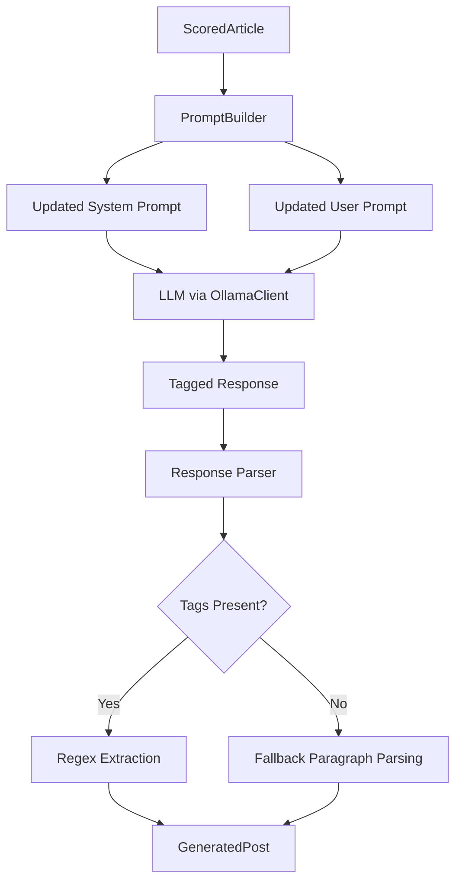

# Design Document: Robust Response Parsing

## Overview

This design enhances the LinkedIn post generator's response parsing by introducing explicit output tags and updating hook style names. The changes target three areas:

1. **System Prompt Updates**: Add instructions forbidding conversational filler and requiring explicit tags
2. **Parser Refactoring**: Replace paragraph-based parsing with regex-based tag extraction
3. **Hook Style Updates**: Change hook style names from "Bold Statement/Contrarian View/Fact-Driven" to "Statistic-heavy/Contrarian/Bold Prediction"

The design maintains backward compatibility by falling back to paragraph-based parsing when tags are absent.

## Architecture



## Components and Interfaces

### 1. PromptBuilder Updates

The `PromptBuilder` class requires updates to two class attributes:

#### SYSTEM_PROMPT Changes

```python
SYSTEM_PROMPT: str = """You are a LinkedIn content strategist specializing in cloud security and enterprise technology. 
Your audience includes CIOs, CISOs, CTOs, and IT Directors in regulated industries 
(finance, healthcare, government, professional services).

Write in a professional yet engaging tone. Be concise and actionable.
Focus on security-first messaging paired with practical modernization guidance.

CRITICAL OUTPUT RULES:
- NEVER use conversational filler like "Here is the post:", "Sure!", "Certainly!", or similar preambles
- Begin your output IMMEDIATELY with the [HOOK] tag
- Use the exact tag format specified in the prompt"""
```

#### HOOK_VALUE_CTA_TEMPLATE Changes

Update the framework requirements section:

```python
HOOK_VALUE_CTA_TEMPLATE: str = """Create a LinkedIn post about the following article using the Hook-Value-CTA framework:

ARTICLE INFORMATION:
- Title: {title}
- Source: {source}
- Summary: {summary}
- Key Topics: {key_topics}
- Why It Matters: {why_it_matters}

FRAMEWORK REQUIREMENTS:

1. HOOK (1-2 sentences): Start with ONE of these attention-grabbing techniques:
   - Statistic-heavy: Lead with a compelling number or data point
   - Contrarian: Challenge conventional wisdom or common assumptions
   - Bold Prediction: Make a confident forecast about the future
   
   IMPORTANT: Avoid starting with a question. Cycle through these hook styles to keep your feed fresh.

2. VALUE (3-5 sentences): Provide the core insight:
   - What's the key announcement or update?
   - What's the practical implication for security teams?
   - What action should leaders consider?

3. CTA (1-2 sentences): End with engagement:
   - Ask a question to spark discussion
   - Invite readers to share their experience
   - Suggest a specific next step

OUTPUT FORMAT (MANDATORY):
Wrap each section in explicit tags. Do NOT include any text before [HOOK].

[HOOK]
Your attention-grabbing opening here
[/HOOK]

[VALUE]
Your core insight content here
[/VALUE]

[CTA]
Your call-to-action here
[/CTA]

[HASHTAGS]
#Hashtag1 #Hashtag2 #Hashtag3
[/HASHTAGS]

HASHTAG REQUIREMENT:
Include exactly 3 hashtags from: {hashtags}

{security_framing}"""
```

### 2. Response Parser Updates

The `_parse_response` method will be refactored to use regex-based extraction:

#### Interface

```python
def _parse_response(self, response: str) -> tuple[str, str, str]:
    """Parse the LLM response into hook, value, and cta sections.
    
    Uses regex to extract content between explicit tags. Falls back to
    paragraph-based parsing if tags are not present.
    
    Args:
        response: The raw text response from the LLM.
        
    Returns:
        A tuple of (hook, value, cta) strings.
    """
```

#### Tag Extraction Helper

```python
def _extract_tagged_section(self, response: str, tag: str) -> str | None:
    """Extract content between [TAG] and [/TAG] markers.
    
    Args:
        response: The full response text.
        tag: The tag name (e.g., "HOOK", "VALUE", "CTA", "HASHTAGS").
        
    Returns:
        The content between tags, or None if tags not found.
    """
```

### 3. Regex Patterns

The following regex patterns will be used for extraction:

```python
import re

# Pattern for extracting tagged sections (case-insensitive, multiline)
TAG_PATTERN = r'\[{tag}\](.*?)\[/{tag}\]'

# Compiled patterns for each section
HOOK_PATTERN = re.compile(r'\[HOOK\](.*?)\[/HOOK\]', re.IGNORECASE | re.DOTALL)
VALUE_PATTERN = re.compile(r'\[VALUE\](.*?)\[/VALUE\]', re.IGNORECASE | re.DOTALL)
CTA_PATTERN = re.compile(r'\[CTA\](.*?)\[/CTA\]', re.IGNORECASE | re.DOTALL)
HASHTAGS_PATTERN = re.compile(r'\[HASHTAGS\](.*?)\[/HASHTAGS\]', re.IGNORECASE | re.DOTALL)
```

## Data Models

### Existing Models (Unchanged)

The `GeneratedPost` dataclass remains unchanged to maintain backward compatibility:

```python
@dataclass
class GeneratedPost:
    full_text: str
    hook: str
    value: str
    cta: str
    hashtags: list[str]
    model_used: str
    generated_at: datetime
    source_url: str
    character_count: int
```

### Internal Parsing Result

```python
@dataclass
class ParsedSections:
    """Internal structure for parsed response sections."""
    hook: str
    value: str
    cta: str
    hashtags: str
    used_tags: bool  # True if tags were found, False if fallback was used
```

## Correctness Properties

*A property is a characteristic or behavior that should hold true across all valid executions of a system—essentially, a formal statement about what the system should do. Properties serve as the bridge between human-readable specifications and machine-verifiable correctness guarantees.*

### Property 1: Tag Extraction Round Trip

*For any* valid tagged response containing [HOOK], [VALUE], [CTA], and [HASHTAGS] sections, extracting each section and reconstructing the tagged format SHALL produce content equivalent to the original sections.

**Validates: Requirements 3.1, 3.2, 3.3, 3.4, 6.5**

### Property 2: Filler Stripping Preserves Content

*For any* response with conversational filler before the [HOOK] tag, the Response_Parser SHALL extract the same hook content as a response without filler.

**Validates: Requirements 3.6**

### Property 3: Fallback Parsing Consistency

*For any* response without explicit tags, the Response_Parser SHALL produce the same output as the original paragraph-based parser.

**Validates: Requirements 5.2, 5.3**

### Property 4: Hook Style Names Present

*For any* article input to PromptBuilder.build(), the resulting prompt SHALL contain all three new hook style names ("Statistic-heavy", "Contrarian", "Bold Prediction") and SHALL NOT contain the old style names ("Bold Statement", "Contrarian View", "Fact-Driven").

**Validates: Requirements 4.1, 4.2, 4.3, 4.5**

### Property 5: No-Filler Instruction Present

*For any* call to PromptBuilder.get_system_prompt(), the returned prompt SHALL contain an instruction forbidding conversational filler.

**Validates: Requirements 1.1, 1.2**

### Property 6: Tag Format Instructions Present

*For any* article input to PromptBuilder.build(), the resulting prompt SHALL contain instructions for all four tag pairs: [HOOK]/[/HOOK], [VALUE]/[/VALUE], [CTA]/[/CTA], [HASHTAGS]/[/HASHTAGS].

**Validates: Requirements 2.1, 2.2, 2.3, 2.4, 2.5**

### Property 7: GeneratedPost Structure Invariant

*For any* successful parse (with or without tags), the resulting GeneratedPost SHALL have non-empty full_text and character_count equal to len(full_text).

**Validates: Requirements 5.1, 5.4**

## Error Handling

### Missing Tags

When one or more tags are missing from the response:

1. Log a warning indicating which tags were not found
2. Fall back to paragraph-based parsing for the missing sections
3. Continue processing without raising an exception

### Malformed Tags

When tags are present but malformed (e.g., `[HOOK]` without `[/HOOK]`):

1. Treat as missing tag and fall back to paragraph parsing
2. Log a warning about the malformed tag

### Empty Sections

When a tagged section is empty (e.g., `[HOOK][/HOOK]`):

1. Return empty string for that section
2. Allow the caller to handle empty sections appropriately

## Testing Strategy

### Property-Based Tests (Hypothesis)

Each correctness property will be implemented as a property-based test with minimum 100 iterations:

| Property | Test File | Description |
|----------|-----------|-------------|
| 1 | `test_generator_properties.py` | Tag extraction round trip |
| 2 | `test_generator_properties.py` | Filler stripping preserves content |
| 3 | `test_generator_properties.py` | Fallback parsing consistency |
| 4 | `test_generator_properties.py` | Hook style names present |
| 5 | `test_generator_properties.py` | No-filler instruction present |
| 6 | `test_generator_properties.py` | Tag format instructions present |
| 7 | `test_generator_properties.py` | GeneratedPost structure invariant |

### Unit Tests

Unit tests will cover:

1. Regex pattern matching for each tag type
2. Edge cases: empty tags, nested tags, case variations
3. Fallback behavior when tags are absent
4. Integration with existing PromptBuilder tests

### Test Data Generators

```python
# Strategy for generating tagged responses
def tagged_response_strategy():
    return st.builds(
        lambda hook, value, cta, hashtags: (
            f"[HOOK]{hook}[/HOOK]\n\n"
            f"[VALUE]{value}[/VALUE]\n\n"
            f"[CTA]{cta}[/CTA]\n\n"
            f"[HASHTAGS]{hashtags}[/HASHTAGS]"
        ),
        hook=st.text(min_size=10, max_size=200),
        value=st.text(min_size=20, max_size=500),
        cta=st.text(min_size=10, max_size=150),
        hashtags=st.text(min_size=5, max_size=50),
    )

# Strategy for generating filler prefixes
def filler_prefix_strategy():
    return st.sampled_from([
        "Here is the post:\n\n",
        "Sure! Here's your LinkedIn post:\n\n",
        "Certainly! I've created the following post:\n\n",
        "Here you go:\n\n",
        "",  # No filler case
    ])
```

### Backward Compatibility Tests

Existing tests in `test_generator_properties.py` will be updated to:

1. Replace old hook style name assertions with new names
2. Add assertions for tag format instructions
3. Verify fallback behavior maintains original functionality
